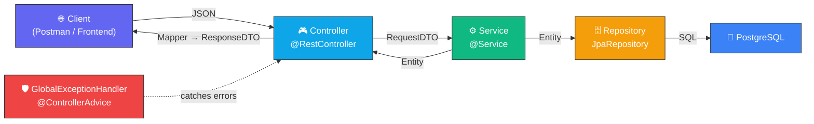
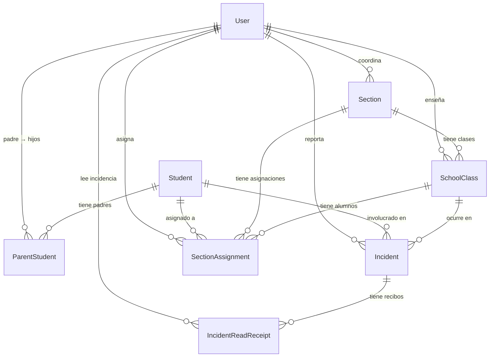

# 🔍 Análisis Completo — API REST Sistema de Incidencias

## Visión General

API REST para gestión de incidencias escolares. Permite registrar usuarios (coordinadores, profesores, padres), estudiantes, secciones, clases, incidencias y acuses de recibo. Construido con arquitectura en capas siguiendo el patrón **Controller → Service → Repository**.

| Dato | Valor |
|---|---|
| **Framework** | Spring Boot 4.0.5 |
| **Java** | 21 |
| **Base de datos** | PostgreSQL (`mi_db`) |
| **ORM** | Spring Data JPA / Hibernate |
| **Build** | Maven |
| **Boilerplate** | Lombok |
| **Puerto** | `8080` |
| **DDL** | `hibernate.ddl-auto=update` |
| **Total archivos Java** | 68 |

---

## 🏛️ Arquitectura



### Flujo de datos

```
REQUEST:  Client ──(JSON)──→ Controller ──(@RequestBody DTO)──→ Service ──(Mapper.toEntity)──→ Repository.save()
RESPONSE: Client ←──(JSON)── Controller ←──(Mapper.toResponseDTO)── Service ←──(Entity)────── Repository
```

### Distribución de archivos por capa

| Capa | Paquete | Archivos |
|---|---|---|
| Controllers | `controller/` | 8 |
| DTOs | `dto/` | 16 (8 Request + 8 Response) |
| Mappers | `mapper/` | 8 |
| Services | `service/` + `service/impl/` | 16 (8 interfaces + 8 impls) |
| Repositories | `repository/` | 8 |
| Entidades | `model/` | 8 |
| Enums | `model/enums/` | 2 |
| Exception | `exception/` | 1 |
| Main | raíz | 1 |
| **Total** | | **68** |

---

## 📊 Diagrama Entidad-Relación



---

## 🏗️ Entidades (Model)

### `User` — tabla `users`
Usuario del sistema. Polimórfico por rol.

| Campo | Tipo | Restricciones |
|---|---|---|
| `id` | Long | PK, autoincremental |
| `name` | String(150) | NOT NULL |
| `email` | String(255) | NOT NULL, UNIQUE |
| `passwordHash` | String(255) | NOT NULL |
| `role` | `UserRole` enum | NOT NULL |
| `isActive` | Boolean | NOT NULL, default `true` |
| `createdAt` | LocalDateTime | auto, inmutable |
| `updatedAt` | LocalDateTime | auto |

Relaciones `1:N` → ParentStudent (como padre), Section (coordinador), SchoolClass (profesor)

---

### `Student` — tabla `students`

| Campo | Tipo | Restricciones |
|---|---|---|
| `id` | Long | PK |
| `firstName` | String(100) | NOT NULL |
| `lastName` | String(100) | NOT NULL |
| `birthDate` | LocalDate | nullable |
| `studentCode` | String(50) | UNIQUE |
| `isActive` | Boolean | NOT NULL, default `true` |
| `createdAt` / `updatedAt` | LocalDateTime | auto |

Relaciones `1:N` → ParentStudent, SectionAssignment, Incident

---

### `Section` — tabla `sections`

| Campo | Tipo | Restricciones |
|---|---|---|
| `id` | Long | PK |
| `name` | String(50) | NOT NULL |
| `grade` | String(50) | NOT NULL |
| `capacity` | Short | NOT NULL |
| `coordinator` | FK → User | NOT NULL |
| `createdAt` / `updatedAt` | LocalDateTime | auto |

Relaciones `1:N` → SchoolClass, SectionAssignment

---

### `SchoolClass` — tabla `classes`

| Campo | Tipo | Restricciones |
|---|---|---|
| `id` | Long | PK |
| `name` | String(100) | NOT NULL |
| `description` | TEXT | nullable |
| `teacher` | FK → User | NOT NULL |
| `section` | FK → Section | NOT NULL |
| `createdAt` / `updatedAt` | LocalDateTime | auto |

Relaciones `1:N` → SectionAssignment, Incident

---

### `Incident` — tabla `incidents` ⭐ Entidad central

| Campo | Tipo | Restricciones |
|---|---|---|
| `id` | Long | PK |
| `title` | String(200) | NOT NULL |
| `description` | TEXT | NOT NULL |
| `student` | FK → Student | NOT NULL |
| `schoolClass` | FK → SchoolClass | NOT NULL |
| `reportedBy` | FK → User | NOT NULL |
| `status` | `IncidentStatus` enum | NOT NULL, default `abierta` |
| `incidentDate` | LocalDateTime | NOT NULL |
| `createdAt` | LocalDateTime | auto, inmutable |

Relación `1:N` → IncidentReadReceipt

---

### `IncidentReadReceipt` — tabla `incident_read_receipts`
Acuse de recibo de un padre sobre una incidencia.

| Campo | Tipo | Restricciones |
|---|---|---|
| `id` | Long | PK |
| `incident` | FK → Incident | NOT NULL |
| `parent` | FK → User | NOT NULL |
| `readAt` | LocalDateTime | auto, inmutable |

**Unique:** `(incident_id, parent_id)` — un padre solo puede acusar recibo una vez por incidencia.

---

### `ParentStudent` — tabla `parent_student`
Relación N:M entre User (padre) y Student.

**Unique:** `(parent_id, student_id)`

---

### `SectionAssignment` — tabla `section_assignments`
Asignación de un estudiante a una clase en una sección.

| Campo | Tipo |
|---|---|
| `student` | FK → Student |
| `section` | FK → Section |
| `schoolClass` | FK → SchoolClass |
| `assignedBy` | FK → User |
| `createdAt` | auto, inmutable |

**Unique:** `(student_id, class_id)`

---

## 📋 Enums

| Enum | Valores | Uso |
|---|---|---|
| `UserRole` | `coordinador`, `profesor`, `padre` | Campo `role` en User |
| `IncidentStatus` | `abierta`, `en_proceso`, `resuelta`, `archivada` | Campo `status` en Incident |

---

## 📦 DTOs

Patrón consistente: **RequestDTO** (entrada) / **ResponseDTO** (salida).

| Entidad | RequestDTO | ResponseDTO |
|---|---|---|
| **User** | name, email, password, role, isActive | + id, createdAt, updatedAt (**sin password**) |
| **Student** | firstName, lastName, birthDate, studentCode, isActive | + id, createdAt, updatedAt |
| **Section** | name, grade, capacity, coordinatorId | + id, createdAt, updatedAt |
| **SchoolClass** | name, description, teacherId, sectionId | + id, createdAt, updatedAt |
| **Incident** | title, description, studentId, classId, reportedById, status, incidentDate | + id, createdAt |
| **IncidentReadReceipt** | incidentId, parentId | + id, readAt |
| **ParentStudent** | parentId, studentId | + id, createdAt |
| **SectionAssignment** | studentId, sectionId, classId, assignedById | + id, createdAt |

> [!NOTE]
> Las relaciones FK se representan como `Long` IDs en los DTOs, evitando serialización circular.

---

## 🔄 Mappers

Todos anotados con `@Component` (beans de Spring, inyectables). Cada mapper tiene 4 métodos:

| Método | Propósito |
|---|---|
| `toResponseDTO(Entity)` | Entity → ResponseDTO |
| `toEntity(RequestDTO)` | RequestDTO → Entity (para crear) |
| `updateEntity(RequestDTO, Entity)` | Modifica entity existente con datos del DTO |
| `toResponseDTOList(List<Entity>)` | Lista de entities → Lista de DTOs |

Para las FK, se crean **entidades stub** (solo con el ID) vía métodos privados `toXxxReference(Long id)`. Validaciones de IDs requeridos en `toEntity()` con `IllegalArgumentException`.

---

## 🗄️ Repositories

Todos `extends JpaRepository<Entity, Long>` con `@Repository`.

| Repository | Queries personalizadas |
|---|---|
| `UserRepository` | `findByEmail(String)`, `existsByEmail(String)` |
| `StudentRepository` | `findByStudentCode(String)`, `existsByStudentCode(String)` |
| `IncidentRepository` | `findByStudentId(Long)`, `findByStatus(IncidentStatus)`, `findByReportedById(Long)` |
| `IncidentReadReceiptRepository` | `findByIncidentId(Long)`, `findByParentId(Long)` |
| `ParentStudentRepository` | `findByParentId(Long)`, `findByStudentId(Long)` |
| `SchoolClassRepository` | `findByTeacherId(Long)`, `findBySectionId(Long)` |
| `SectionRepository` | `findByGrade(String)`, `findByCoordinatorId(Long)` |
| `SectionAssignmentRepository` | `findByStudentId(Long)`, `findBySectionId(Long)` |

---

## ⚙️ Services

8 interfaces + 8 implementaciones. Todos usan el patrón:
- Inyectan **Repository** + **Mapper** + repositorios de FK relacionadas
- Métodos `create()` y `update()` reciben **DTOs**, usan mapper para convertir, y devuelven **Entity**
- Validaciones de existencia de FKs al crear (`existsById()`)
- `@Transactional` en mutaciones, `@Transactional(readOnly = true)` en lecturas

| Service | Operaciones | Validaciones al crear |
|---|---|---|
| `UserService` | CRUD completo + buscar por email | Email duplicado |
| `StudentService` | CRUD completo + buscar por código | Código duplicado |
| `SectionService` | CRUD completo | Coordinador existe |
| `SchoolClassService` | CRUD + filtro por teacher | Teacher y section existen |
| `IncidentService` | CRUD + filtros por student y status | Student, user reportero y class existen |
| `IncidentReadReceiptService` | CR + filtros por incident y parent | Incident y parent existen |
| `ParentStudentService` | CR + filtros por parent y student | Parent y student existen |
| `SectionAssignmentService` | CR + filtros por student y section | Student, section, class y assignedBy existen |

---

## 🎮 Controllers — Catálogo completo de endpoints

### `UserController` — `/api/v1/users`

| Método | Endpoint | Descripción | Request Body | Response |
|---|---|---|---|---|
| `GET` | `/api/v1/users` | Listar todos | — | `200` List\<UserResponseDTO\> |
| `GET` | `/api/v1/users/{id}` | Obtener por ID | — | `200` / `404` |
| `GET` | `/api/v1/users/email/{email}` | Buscar por email | — | `200` / `404` |
| `POST` | `/api/v1/users` | Crear usuario | UserRequestDTO | `201` UserResponseDTO |
| `PUT` | `/api/v1/users/{id}` | Actualizar usuario | UserRequestDTO | `200` UserResponseDTO |
| `DELETE` | `/api/v1/users/{id}` | Eliminar usuario | — | `204` |

---

### `StudentController` — `/api/v1/students`

| Método | Endpoint | Descripción | Request Body | Response |
|---|---|---|---|---|
| `GET` | `/api/v1/students` | Listar todos | — | `200` List |
| `GET` | `/api/v1/students/{id}` | Obtener por ID | — | `200` / `404` |
| `GET` | `/api/v1/students/code/{code}` | Buscar por código | — | `200` / `404` |
| `POST` | `/api/v1/students` | Crear | StudentRequestDTO | `201` |
| `PUT` | `/api/v1/students/{id}` | Actualizar | StudentRequestDTO | `200` |
| `DELETE` | `/api/v1/students/{id}` | Eliminar | — | `204` |

---

### `SectionController` — `/api/v1/sections`

| Método | Endpoint | Descripción | Request Body | Response |
|---|---|---|---|---|
| `GET` | `/api/v1/sections` | Listar todas | — | `200` List |
| `GET` | `/api/v1/sections/{id}` | Obtener por ID | — | `200` / `404` |
| `POST` | `/api/v1/sections` | Crear | SectionRequestDTO | `201` |
| `PUT` | `/api/v1/sections/{id}` | Actualizar | SectionRequestDTO | `200` |
| `DELETE` | `/api/v1/sections/{id}` | Eliminar | — | `204` |

---

### `SchoolClassController` — `/api/v1/classes`

| Método | Endpoint | Descripción | Request Body | Response |
|---|---|---|---|---|
| `GET` | `/api/v1/classes` | Listar todas | — | `200` List |
| `GET` | `/api/v1/classes/{id}` | Obtener por ID | — | `200` / `404` |
| `GET` | `/api/v1/classes/teacher/{teacherId}` | Filtrar por profesor | — | `200` List |
| `POST` | `/api/v1/classes` | Crear | SchoolClassRequestDTO | `201` |
| `PUT` | `/api/v1/classes/{id}` | Actualizar | SchoolClassRequestDTO | `200` |
| `DELETE` | `/api/v1/classes/{id}` | Eliminar | — | `204` |

---

### `IncidentController` — `/api/v1/incidents`

| Método | Endpoint | Descripción | Request Body | Response |
|---|---|---|---|---|
| `GET` | `/api/v1/incidents` | Listar todas | — | `200` List |
| `GET` | `/api/v1/incidents/{id}` | Obtener por ID | — | `200` / `404` |
| `GET` | `/api/v1/incidents/student/{studentId}` | Filtrar por estudiante | — | `200` List |
| `GET` | `/api/v1/incidents/status/{status}` | Filtrar por estado | — | `200` List |
| `POST` | `/api/v1/incidents` | Crear | IncidentRequestDTO | `201` |
| `PUT` | `/api/v1/incidents/{id}` | Actualizar | IncidentRequestDTO | `200` |
| `DELETE` | `/api/v1/incidents/{id}` | Eliminar | — | `204` |

---

### `IncidentReadReceiptController` — `/api/v1/incident-receipts`

| Método | Endpoint | Descripción | Request Body | Response |
|---|---|---|---|---|
| `GET` | `/api/v1/incident-receipts` | Listar todos | — | `200` List |
| `GET` | `/api/v1/incident-receipts/{id}` | Obtener por ID | — | `200` / `404` |
| `GET` | `/api/v1/incident-receipts/incident/{incidentId}` | Filtrar por incidencia | — | `200` List |
| `GET` | `/api/v1/incident-receipts/parent/{parentId}` | Filtrar por padre | — | `200` List |
| `POST` | `/api/v1/incident-receipts` | Crear recibo | IncidentReadReceiptRequestDTO | `201` |
| `DELETE` | `/api/v1/incident-receipts/{id}` | Eliminar | — | `204` |

---

### `ParentStudentController` — `/api/v1/parent-students`

| Método | Endpoint | Descripción | Request Body | Response |
|---|---|---|---|---|
| `GET` | `/api/v1/parent-students` | Listar todos | — | `200` List |
| `GET` | `/api/v1/parent-students/{id}` | Obtener por ID | — | `200` / `404` |
| `GET` | `/api/v1/parent-students/parent/{parentId}` | Hijos de un padre | — | `200` List |
| `GET` | `/api/v1/parent-students/student/{studentId}` | Padres de un alumno | — | `200` List |
| `POST` | `/api/v1/parent-students` | Asociar padre-alumno | ParentStudentRequestDTO | `201` |
| `DELETE` | `/api/v1/parent-students/{id}` | Eliminar | — | `204` |

---

### `SectionAssignmentController` — `/api/v1/section-assignments`

| Método | Endpoint | Descripción | Request Body | Response |
|---|---|---|---|---|
| `GET` | `/api/v1/section-assignments` | Listar todos | — | `200` List |
| `GET` | `/api/v1/section-assignments/{id}` | Obtener por ID | — | `200` / `404` |
| `GET` | `/api/v1/section-assignments/student/{studentId}` | Filtrar por alumno | — | `200` List |
| `GET` | `/api/v1/section-assignments/section/{sectionId}` | Filtrar por sección | — | `200` List |
| `POST` | `/api/v1/section-assignments` | Crear asignación | SectionAssignmentRequestDTO | `201` |
| `DELETE` | `/api/v1/section-assignments/{id}` | Eliminar | — | `204` |

---

## 🛡️ Manejo de Errores

`GlobalExceptionHandler` (`@RestControllerAdvice`) captura excepciones globalmente:

| Excepción | HTTP Status | Cuándo |
|---|---|---|
| `RuntimeException` | `400 Bad Request` | Validaciones de negocio (email duplicado, FK no existe, etc.) |
| `IllegalArgumentException` | `400 Bad Request` | Validaciones en mappers (campos requeridos) |
| `NoSuchElementException` | `404 Not Found` | Entidad no encontrada |
| `Exception` | `500 Internal Server Error` | Errores inesperados |

Respuesta estándar de error:
```json
{
  "status": 400,
  "message": "El email ya está registrado",
  "timestamp": "2026-04-11T12:30:00"
}
```

---

## 📂 Estructura final del proyecto

```
src/main/java/com/utp/sistemaincidencias/
├── SistemaIncidenciasApplication.java
├── controller/
│   ├── IncidentController.java
│   ├── IncidentReadReceiptController.java
│   ├── ParentStudentController.java
│   ├── SchoolClassController.java
│   ├── SectionAssignmentController.java
│   ├── SectionController.java
│   ├── StudentController.java
│   └── UserController.java
├── dto/
│   ├── IncidentReadReceiptRequestDTO / ResponseDTO
│   ├── IncidentRequestDTO / ResponseDTO
│   ├── ParentStudentRequestDTO / ResponseDTO
│   ├── SchoolClassRequestDTO / ResponseDTO
│   ├── SectionAssignmentRequestDTO / ResponseDTO
│   ├── SectionRequestDTO / ResponseDTO
│   ├── StudentRequestDTO / ResponseDTO
│   └── UserRequestDTO / ResponseDTO
├── exception/
│   └── GlobalExceptionHandler.java
├── mapper/
│   ├── IncidentMapper.java
│   ├── IncidentReadReceiptMapper.java
│   ├── ParentStudentMapper.java
│   ├── SchoolClassMapper.java
│   ├── SectionAssignmentMapper.java
│   ├── SectionMapper.java
│   ├── StudentMapper.java
│   └── UserMapper.java
├── model/
│   ├── enums/
│   │   ├── IncidentStatus.java
│   │   └── UserRole.java
│   ├── Incident.java
│   ├── IncidentReadReceipt.java
│   ├── ParentStudent.java
│   ├── SchoolClass.java
│   ├── Section.java
│   ├── SectionAssignment.java
│   ├── Student.java
│   └── User.java
├── repository/
│   ├── (8 interfaces JpaRepository)
└── service/
    ├── (8 interfaces)
    └── impl/
        └── (8 implementaciones)
```

---

## 📈 Resumen numérico

| Métrica | Valor |
|---|---|
| Total archivos Java | **68** |
| Endpoints REST | **48** |
| Entidades JPA | **8** |
| Tablas en PostgreSQL | **8** |
| DTOs | **16** |
| Enums | **2** |
| Relaciones FK | **12** |
| Unique Constraints | **3** (parent_student, section_assignments, incident_read_receipts) |

---

## 🔮 Posibles mejoras futuras

1. **Spring Security + JWT** — Autenticación/autorización por rol (coordinador, profesor, padre)
2. **Bean Validation** — `@NotNull`, `@Size`, `@Email` en los DTOs con `@Valid` en controllers
3. **Excepciones custom** — `ResourceNotFoundException`, `DuplicateResourceException` en vez de `RuntimeException` genérico
4. **Paginación** — `Pageable` en los endpoints de listado para manejar volumen
5. **CORS** — Configurar `@CrossOrigin` o `WebMvcConfigurer` para frontend
6. **Password hashing** — Integrar `BCryptPasswordEncoder` con Spring Security
7. **Documentación API** — Swagger/OpenAPI con `springdoc-openapi`
8. **Tests** — Unit tests para services + integration tests para controllers
